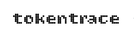

<h1 align="center">
  <picture>
    <source media="(prefers-color-scheme: dark)" srcset="docs/assets/wordmark-dark.png">
    
  </picture>
</h1>

<p align="center">
  <strong>Automatic session recording for coding agents.</strong><br>
  Every Claude Code and Codex session — transcript, cost, diff — saved locally without any setup.
</p>

<p align="center">
  <a href="https://www.npmjs.com/package/@j___avi/tokentrace"></a>
  <a href="LICENSE"></a>
  <a href="https://github.com/12122J/tokentrace"></a>
</p>

<br>

<p align="center">
  
</p>

<br>

## Install

```bash
npm install -g @j___avi/tokentrace
tt install
```

That's it. **Restart your shell once** after install. Every session is now recorded automatically.

```
✓ Claude Code hook installed → ~/.claude/settings.json
✓ Codex CLI shim installed  → ~/.zshrc
✓ Codex Desktop watcher installed → ~/Library/LaunchAgents/io.tokentrace.codex-watcher.plist
```

## What gets recorded automatically

| Surface | Status |
|---|---|
| Claude Code CLI | ✅ Automatic |
| Claude Code Desktop | ✅ Automatic — same hook file |
| Claude Code VS Code extension | ✅ Automatic — same hook file |
| Codex CLI | ✅ Automatic — transparent shell shim after `tt install` |
| Codex Desktop app | ✅ Automatic — background watcher every 30 s (macOS) |
| VS Code / IDE plugins | 🔜 Planned |

## See your sessions

```bash
tt summarize
```

```
2026-05-25   ok   tokens=223K   cost=$1.43    changed=7    claude-sonnet-4-6   Refactor auth middleware to use JWT
2026-05-24   ok   tokens=104K   cost=$0.71    changed=4    claude-sonnet-4-6   Add dark mode to settings page
2026-05-24   ok   tokens=44K    cost=$0.23    changed=2    gpt-5.5             Fix race condition in queue processor
2026-05-23   ok   tokens=84K    cost=$0.43    changed=17   gpt-5.5   DESKTOP   Write unit tests for billing module
2026-05-22   ok   tokens=531K   cost=$11.24   changed=12   claude-opus-4-7     Migrate Postgres schema to multi-tenancy
```

## Open the dashboard

```bash
tt serve        # start server + open browser
tt stop         # stop the server
```

Browse sessions, compare cost over time, inspect transcripts and diffs, set a VAT rate. The dashboard shows each session's surface — CLI, Desktop app, or IDE extension.

## What's inside each recorded session

```
~/.tokentrace/runs/<session-id>/
  run.json        # agent, model, tokens, cost, git state, duration
  transcript.txt  # full conversation — user prompts and agent replies
  diff.patch      # every file the agent touched, as a unified patch
  summary.md      # human-readable one-page summary
  report.html     # standalone HTML report, openable offline
```

Example `tt summarize` output for a single session:

```
2026-05-25T09:12Z   ok   tokens=223K   cost=$1.43   changed=7   claude
```

## Why it exists

Agent sessions disappear into terminal scrollback. You either trust the result or you don't, with nothing in between. tokentrace gives you the evidence:

- **Cost visibility** — token spend per session, cost per day, running total
- **Trust** — full transcript + git diff attached to every session
- **Debugging** — when an agent does something unexpected, the log tells you exactly what happened
- **PR evidence** — attach `summary.md` or `diff.patch` to pull requests so reviewers see what the agent actually did

## MCP server — query your sessions from inside Claude Code

tokentrace ships an MCP server that gives Claude Code direct access to your local session data. Once configured, you can ask questions about your sessions in plain English — mid-conversation, no dashboard needed.

**Setup:** add this to `~/.claude/mcp.json` (create the file if it doesn't exist):

```json
{
  "mcpServers": {
    "tokentrace": {
      "command": "npx",
      "args": ["-y", "-p", "@j___avi/tokentrace", "tokentrace-mcp"]
    }
  }
}
```

Restart Claude Code, then ask inside any session:

> *"how much have I spent on tokens this week?"*
> *"what did I change in my last session?"*
> *"show me the diff from yesterday"*

Claude will query your `~/.tokentrace/runs/` folder directly — nothing leaves your machine. Works in Claude Code CLI, Desktop app, and VS Code extension.

## Honest limitations

tokentrace reads what's available from each surface. Some data isn't logged by the agents themselves:

| Surface | Token count | Cost | Transcript |
|---|---|---|---|
| Claude Code CLI / Desktop / VS Code | ✅ input + output | ✅ exact | ✅ full |
| Codex CLI (via shim) | ✅ input + output | ✅ exact | ✅ full |
| Codex Desktop | ✅ input + output (per-turn) | ✅ exact | ✅ full |

## Development

```bash
git clone https://github.com/12122J/tokentrace
cd tokentrace
npm install
npm test         # 48 tests

# Run with demo data
node scripts/gen-demo-data.mjs
TOKENTRACE_RUNS_DIR=~/.tokentrace-demo/runs tt serve
```

## Contributing

Contributions are welcome. See [CONTRIBUTING.md](CONTRIBUTING.md). Keep new features grounded in portable, local-first traces.

## License

MIT — [12122J](https://github.com/12122J)
